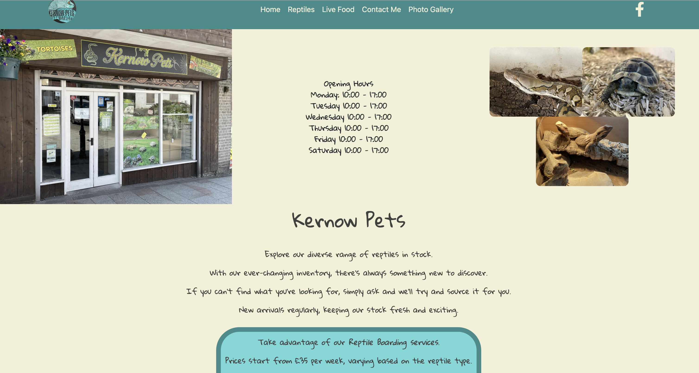
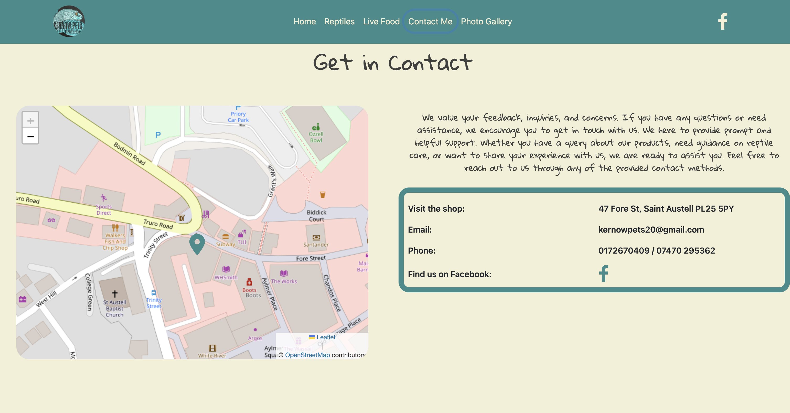

# Kernow Pets

Welcome to Kernow Pets, a commercial website specializing in the sale of reptiles, reptile housing, live feed, and accessories. Located in St Austell, Cornwall, our store offers a wide range of products and services to cater to reptile enthusiasts.

## Table of Contents

- [Kernow Pets](#kernow-pets)
  - [Table of Contents](#table-of-contents)
  - [Introduction](#introduction)
  - [Website Status](#website-status)
  - [Features](#features)
  - [Location](#location)
  - [Screenshots](#screenshots)
  - [Running the React App Locally](#running-the-react-app-locally)
  - [Future Developments](#future-developments)
  - [License](#license)
  - [Questions](#questions)
  - [Website Contact](#website-contact)
  - [Developer Contact](#developer-contact)

Portfolio built on

using

Technologies, frameworks and libraries used include:

## Introduction

Kernow Pets is your one-stop destination for all things reptile-related. Whether you're a seasoned reptile keeper or a beginner looking to start your reptile journey, we have the products and expertise to meet your needs. Our goal is to provide high-quality reptiles, housing solutions, live feed, and accessories to ensure the well-being of your scaly companions.

## Website Status

Kernow Pets website has been built by Alana Barrett-Frew for the Kernow Pets Shop owner. The website showcases a selection of products and provides information about their services. Please note that while online purchasing is not available at the moment, you can visit the physical store in St Austell, Cornwall to explore the complete inventory and make a purchase.

## Features

The Kernow Pets website offers the following features:

- Products Available: Browse through the website to discover a variety of reptiles, reptile housing options, live feed, and accessories. While not all products are listed online, visiting the store allows you to explore the complete inventory and find the perfect items for your reptile companions.

- Detailed product information: Caresheets are available for a variety of stock. Feel free to contact direct or visit the store for more information on specific products.

- Store information: The website includes details about the store location, allowing you to easily find it in St Austell, Cornwall. Visit the store in person to see the wide selection of products and receive personalized assistance from the knowledgeable owner Jamie.

- Customer support: Contact us to answer any questions you may have. Jamie values your satisfaction and is committed to providing excellent customer service both online and in-store. Don't hesitate to reach out for assistance or expert advice.

## Location

Kernow Pets is located in St Austell, Cornwall. The physical store is designed to create a welcoming environment for reptile enthusiasts. Visit us and explore the complete range of products, receive expert guidance, and connect with other reptile lovers.

## Screenshots

Here are some screenshots of the Kernow Pets website:

## Running the React App Locally

If you are Alana Barrett-Frew or the developer who built the Kernow Pets React app and would like to run it locally on your machine, follow these steps:

- Clone this repository to your local environment.
- Ensure that you have Node.js installed on your system.
- Open a terminal and navigate to the project's root directory.
- Run the command npm install to install the project dependencies.
- Once the installation is complete, run npm start to start the development server.
- Open your web browser and visit [localhost:5173](http://localhost:5173) to view the Kernow Pets website.

Please note that this assumes you have a basic understanding of React development and have the necessary tools set up on your machine.

Feel free to explore the codebase, make modifications, and continue improving the Kernow Pets website. I appreciate any comments or feedback.

## Future Developments

Potential plans for the future website development of Kernow Pets:

- Online shop: We are actively working on implementing an online purchasing system, allowing you to conveniently shop for reptiles, housing, live feed, and accessories from the comfort of your own home.

- Live bug postal delivery service: We understand the importance of providing fresh and nutritious live feed for your reptiles. In the near future, we aim to offer a live bug delivery service, ensuring your reptiles always have access to high-quality feed.

Stay tuned for these exciting updates as I strive to enhance your shopping experience and meet your reptile care needs.

## License

*This project is licensed under* [MIT](https://choosealicense.com/licenses/mit/)

## Questions

*Contact me if you have any questions or need to report a problem. Alternatively open an issue.*

## Website Contact

For any questions, comments, or inquiries related to the Kernow Pets website, please feel free to reach out to us:

- Address: 47 Fore St, Saint Austell PL25 5PY
- Phone: 0172670409 / 07470 295362
- Email: [kernowpets20@gmail.com](mailto:kernowpets20@gmail.com)
- Website: [kernowpets.com](https://kernowpets.com)
- Facebook: [https://www.facebook.com/kernowpet](https://www.facebook.com/kernowpet)

## Developer Contact

For any questions, comments, or inquiries related to the development of the Kernow Pets website, please feel free to reach out to the developer, Alana Barrett-Frew:

- My Portfolio Site [alanabarrettfrew.com](https://alanabarrettfrew.com)
- Find me on GitHub: [AlanaBF](https://github.com/AlanaBF)
- Email: [alanabarrett-frew@hotmail.com](mailto:alanabarrett-frew@hotmail.com)

Thank you for your interest in Kernow Pets. We appreciate your support and look forward to serving you and your reptile companions with top-quality products and exceptional customer service.
